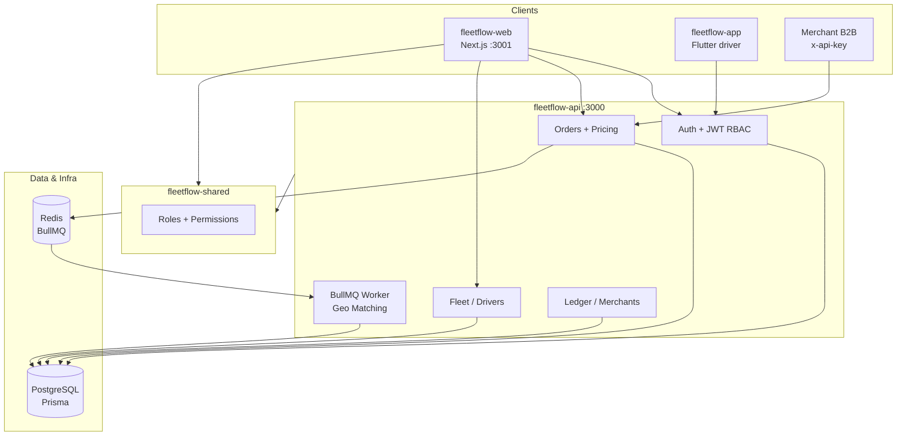
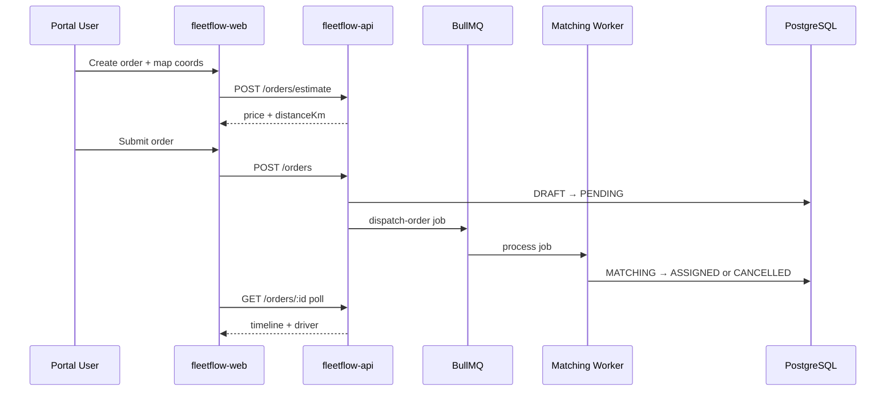

# FleetFlow Architecture

High-level system design for portfolio demos and technical interviews.

## System diagram

## Order dispatch flow

## Monorepo layout

| Package | Role |
|---------|------|
| `fleetflow-api` | NestJS REST, BullMQ matching, Prisma |
| `fleetflow-web` | Next.js portal, RBAC middleware, Playwright |
| `fleetflow-shared` | RBAC contracts shared by API + web |
| `fleetflow-infra` | Docker Compose (Postgres, Redis) |
| `fleetflow-app` | Flutter driver mobile (optional demo) |
| `fleetflow-docs` | QA guide, planning |

## RBAC (6 roles)

| Role | Core access |
|------|-------------|
| Super Admin | All modules |
| Regional Manager | Orders, fleet, merchants, ledger |
| Head of Warehouse | Orders, fleet, ledger |
| Fleet Operator | Orders, fleet, drivers |
| Merchant Admin | Create + track own orders |
| Driver Partner | Assigned orders only |

## Portfolio video script (~4 min)

1. **Architecture** — show this diagram (30s)
2. **Login** — Super Admin + Merchant Admin demo accounts (30s)
3. **RBAC** — merchant blocked on `/fleet` (20s)
4. **Create order** — map picker + price estimate → submit (60s)
5. **Tracker** — poll until `ASSIGNED`, show driver (45s)
6. **Ops** — Fleet control driver roster, merchants wallet (45s)
7. **QA** — mention Playwright + live API tests (20s)

## Stack

- **API:** NestJS, Prisma, PostgreSQL, BullMQ, Redis, JWT
- **Web:** Next.js 15, React 19, Zustand, Formik, Leaflet
- **QA:** Jest, Playwright, live-stack e2e
