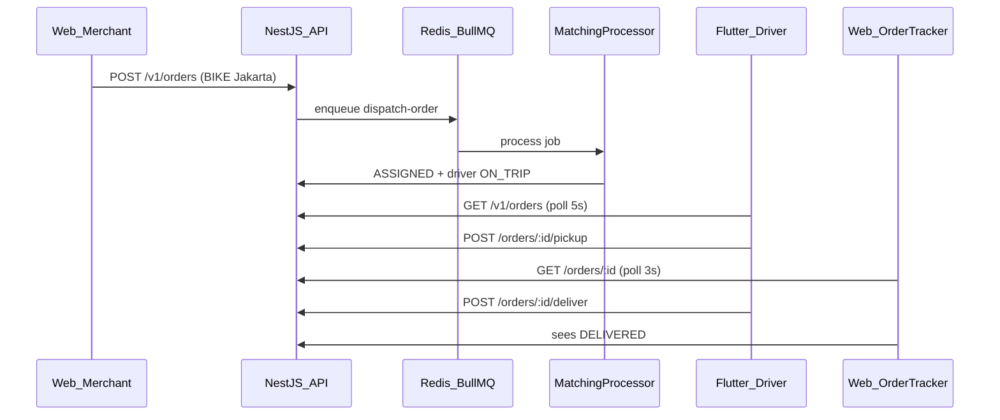

# FleetFlow end-to-end demo (Web ↔ API ↔ Flutter)

**Document ID:** FF-DEMO-E2E-001  
**Audience:** Portfolio demo / video recording  
**Last updated:** 2026-07-14

This is the real dispatch loop used for demos. No mocks.



---

## 1. Start the stack

### Infrastructure + API

```bash
cd fleetflow-infra
docker compose up -d
```

Services: PostgreSQL `5432`, Redis `6379`, API `3000` (matching runs **inside** the API process).

### Reset drivers before each take (important)

If a prior trip left Alex as `ON_TRIP`, matching will skip him and may cancel the order.

```bash
# Preferred when API runs in Docker:
docker exec fleetflow-api sh -c "cd /app/fleetflow-api && node scripts/qa-reset-drivers.mjs"

# Or from monorepo (local API with installed node_modules):
pnpm --filter @fleetflow/api run qa:reset-drivers
```

Or with Prisma Studio / SQL: set Alex Rivera `status = AVAILABLE`.

### Web portal

```bash
cd fleetflow-web
# NEXT_PUBLIC_API_URL=http://localhost:3000/v1
pnpm dev
```

Open `http://localhost:3001`

### Flutter driver app (Edge / Chrome)

```bash
cd fleetflow-app
# .env → FLEETFLOW_API_BASE_URL=http://localhost:3000/v1
flutter run -d edge --web-port=52511
```

---

## 2. Credentials

| Actor | Email | Password | Role |
|-------|-------|----------|------|
| Merchant (create order) | `merchant.admin@acme-commerce.id` | `FleetFlow!2026` | `MERCHANT_ADMIN` |
| Driver (Flutter) | `driver.partner@fleetflow.dev` | `FleetFlow!2026` | `DRIVER_PARTNER` |
| Fleet operator (web pickup/deliver) | `fleet.operator@fleetflow.dev` | `FleetFlow!2026` | `FLEET_OPERATOR` |
| Superadmin (web pickup/deliver) | `superadmin@fleetflow.dev` | `FleetFlow!2026` | `SUPERADMIN` |

Alex Rivera (seed BIKE) sits at **-6.2012, 106.8175**. Web create-order form defaults use Jakarta coords within **10 km** so he matches.

---

## 3. Demo script (video)

### Take A — Merchant creates the job

1. Web: login as **merchant.admin@acme-commerce.id**
2. Go to **Orders → Create** (`/orders/create`)
3. Keep defaults (**BIKE**, Thamrin → Sudirman, Jakarta lat/lng)
4. Submit → land on **order detail** (`/orders/{id}`)
5. Wait until status becomes **ASSIGNED** (usually a few seconds). Tracker polls every **3s** through the whole trip.

Optional: while Flutter is open on **Alerts**, confirm badge + SnackBar when matching assigns (see [DRIVER_NOTIFICATIONS.md](./DRIVER_NOTIFICATIONS.md)).

### Take B — Driver or ops completes the trip

**Option 1 — Flutter driver**

1. Flutter: login as **driver.partner@fleetflow.dev**
2. **Active** shows the assigned trip within ~5s (or pull to refresh)
3. Open the trip → map + addresses
4. Tap **Confirm pickup** → status `PICKED_UP`
5. Tap **Confirm delivery** → status `DELIVERED`

**Option 2 — Web dispatch ops**

1. Web: login as **fleet.operator@fleetflow.dev** or **superadmin@fleetflow.dev**
2. Open the same order at `/orders/{id}`
3. Below the trip map: **Dispatch operations** → **Confirm pickup** / **Confirm delivery**

Both paths use `POST /orders/:id/pickup` and `POST /orders/:id/deliver`.

### Take C — Web reflects the update

1. Keep the merchant order-detail tab open during Take B
2. Watch stepper / timeline move **ASSIGNED → PICKED_UP → DELIVERED** without a manual refresh

Optional: login web as the same driver → **Your assigned trips** also polls every 5s.

---

## 4. API cheat sheet (optional)

```http
POST /v1/auth/login
{ "email":"merchant.admin@acme-commerce.id","password":"FleetFlow!2026","role":"MERCHANT_ADMIN" }

POST /v1/orders
Authorization: Bearer <token>
{
  "vehicleTypeRequired": "BIKE",
  "pickupAddress": "Jl. Thamrin No. 1, Jakarta Pusat",
  "deliveryAddress": "Jl. Sudirman No. 52, Jakarta Selatan",
  "pickupLat": -6.2,
  "pickupLng": 106.816666,
  "deliveryLat": -6.17511,
  "deliveryLng": 106.865036
}

POST /v1/auth/login
{ "email":"driver.partner@fleetflow.dev","password":"FleetFlow!2026","role":"DRIVER_PARTNER" }

POST /v1/auth/login
{ "email":"fleet.operator@fleetflow.dev","password":"FleetFlow!2026","role":"FLEET_OPERATOR" }

GET  /v1/orders
POST /v1/orders/{id}/pickup
POST /v1/orders/{id}/deliver
```

Merchant API key alternative: header `x-api-key: ff_live_merchant_acme_7f3c9a2e`

---

## 5. What must be running

| Piece | Required | Notes |
|-------|----------|--------|
| Postgres | Yes | Seeded users/drivers |
| Redis | Yes | BullMQ dispatch queue |
| `fleetflow-api` | Yes | Hosts matching worker |
| Separate matcher container | No | Stub only under `fleetflow-infra/matching` |
| Web | Yes | Create + live tracker |
| Flutter | Yes | Pickup / deliver |

---

## 6. Failure checklist

| Symptom | Fix |
|---------|-----|
| Order goes `CANCELLED` | Run `qa:reset-drivers`; ensure Alex is `AVAILABLE` and BIKE |
| Flutter empty Active | Wait ≤5s / pull refresh; confirm order `ASSIGNED` to Alex |
| Web stuck on ASSIGNED while Flutter already delivered | Old build — update `OrderTracker` polls through `PICKED_UP` (see changelog below) |
| Browser CORS / empty login response | API must allow `localhost:<port>`; rebuild Docker API after CORS changes |
| Flutter calls wrong host | Use `.env` `http://localhost:3000/v1` for Edge (not `10.0.2.2`, not `/api/v1`) |
| API restart wiped demo data | Docker API seeds on start — finish the take before rebuild |

---

## 7. Changelog (demo readiness)

| Date | Change |
|------|--------|
| 2026-07-14 | Web order detail trip map (pickup, destination, driver last known GPS) |
| 2026-07-14 | API `assignedDriver.currentLat/Lng` on order detail |
| 2026-07-14 | Web driver panel polls every 5s |
| 2026-07-14 | Flutter Active list polls every 5s |
| 2026-07-14 | Flutter real login/orders/pickup/deliver (no mocks) |
| 2026-07-14 | API CORS allows local Flutter web origins |

---

## Related docs

- [ARCHITECTURE.md](./ARCHITECTURE.md) — system design
- [QA_TESTING.md](./QA_TESTING.md) — automated QA pyramid
- [merchant-admin-manual.md](./docs/reference/merchant-admin-manual.md)
- [driver-partner-manual.md](./docs/reference/driver-partner-manual.md)
- [fleetflow-app/README.md](../fleetflow-app/README.md)
- [fleetflow-infra/README.md](../fleetflow-infra/README.md)
